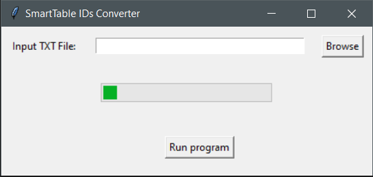

# SmartTable-IDs-Converter

Fast and lightweight windows x86 gui app that converts in place a file with identifiers derived from metacyc/biocyc/plantcyc into a 1-column txt file 

# Installation

Download `SmartTable IDs Converter.exe` from:  

## Usage

1. Go to metacyc/plantcyc/biocyc etc and select an organism and a pathway
2. create a SmartTable by clicking `Add to SmartTable` and selecting `New SmartTable`
3. in the `Add Transform column` select `Genes of pathway`
4. Click the 1st row and select delete, then click `Export -> to Spreadsheet File`
5. Open `SmartTable IDs Converter.exe` and click `Browse` to select an input file
6. Click `Run program` to convert the file in place

Example input/output files can be found in the `data/` folder
Input data were derived from TomatoCyc v4.0
